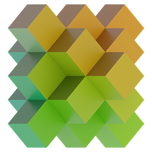
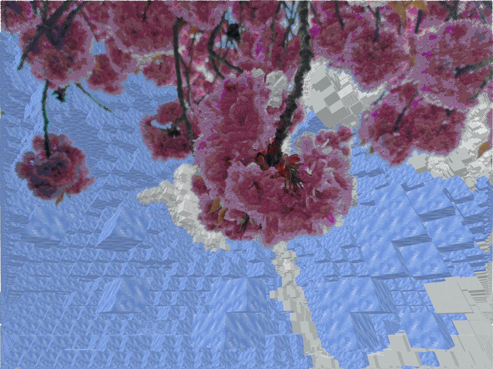
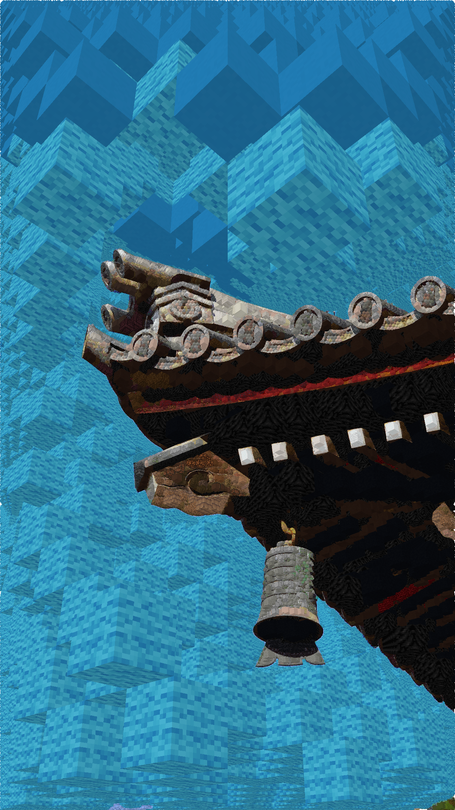
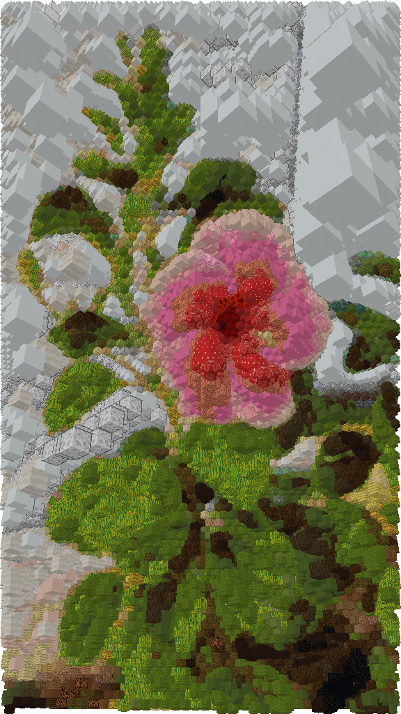

<a href="https://voxelartcraft.de/" target="_blank">
  <strong style="font-size: 4em;">Voxelartcraft</strong>
</a>

## Description

This project is a Minecraft website that allows to create perspective art or pixel art from images. It provides a user-friendly interface for uploading images and selecting blocks and features NBT export functionality.

## Examples

